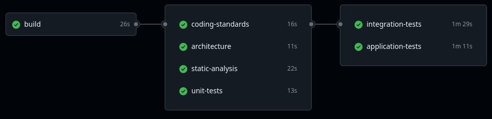

# 🛍️ Shop System

A **simple e-commerce platform** built with cutting-edge technologies, showcasing advanced software architecture patterns and best practices.


## 🏗️ Architecture Highlights

### Modular Design
The system is organized into **bounded contexts** (Auth, Commerce, Payment) that can evolve independently. Each module has its own domain logic, application services, and infrastructure concerns.

### CQRS Implementation
- **Commands** handle write operations (create product, update order status)
- **Queries** handle read operations (search products, get order details)
- **Async commands** for non-critical operations (email notifications, status updates)

### Event-Driven Side Effects
Instead of tight coupling, the system uses domain events to trigger side effects:
- Product created → Index in Elasticsearch
- Order status changed → Send notification
- User registered → Create client profile

## 🚀 Development

### Installation

**Start the development environment**
```bash
cd development && ./build.sh
```

**Access the application**
- **Frontend**: http://localhost:3000
- **Backend API**: http://localhost/api/v1
- **API Documentation**: http://localhost/api/doc
- **RabbitMQ Management**: http://localhost:15672
- **MailHog**: http://localhost:8025

### First Steps

1. **Register a new user** via the frontend or API
2. **Login** to get your JWT token
3. **Create some products** (admin only)
4. **Browse and search** products
5. **Place an order** to see the full flow

## 📚 API Overview

The API follows RESTful principles with consistent response formats. All protected endpoints require a JWT token in the Authorization header.

### Authentication
```http
POST /api/v1/register    # Create account
POST /api/v1/login       # Get JWT token
```

### Products
```http
GET    /api/v1/products/get-paginated  # List products
POST   /api/v1/products/create         # Create product (admin)
GET    /api/v1/products/show/{slug}    # Get product details
PUT    /api/v1/products/update/{id}    # Update product (admin)
DELETE /api/v1/products/delete/{id}    # Delete product (admin)
GET    /api/v1/products/search         # Search products
```

### Orders
```http
GET  /api/v1/orders/get-paginated        # List orders
POST /api/v1/orders/create               # Create order
GET  /api/v1/orders/show/{uuid}          # Get order details
POST /api/v1/orders/change-status/{uuid} # Update status (admin)
```

📖 **Full API Documentation**: http://localhost/api/doc

## 🏗️ Code Structure

The project follows **Clean Architecture** principles with **Domain-Driven Design** organization. Here's how it's structured and why:

```
src/
├── Common/                  # Shared infrastructure & utilities
│   ├── Application/         # Cross-cutting application concerns
│   │   ├── Bus/             # Command & Query buses
│   │   ├── DTO/             # Shared data transfer objects
│   │   ├── Security/        # User context & authentication
│   │   └── Constraint/      # Shared validation rules
│   ├── Domain/              # Shared domain concepts
│   ├── Infrastructure/      # Shared infrastructure
│   └── Interface/           # Shared interface concerns
│
└── Module/                  # Business domain modules
    ├── Auth/                # Authentication & user management
    ├── Commerce/            # E-commerce core functionality
    └── Payment/             # Payment processing
```

### 🎯 **Why This Structure?**

**Modular Design**: Each module represents a **bounded context** in Domain-Driven Design. This means:
- **Auth** handles user registration, login, and roles
- **Commerce** manages products, orders, and clients  
- **Payment** processes payments and transactions

**Clean Architecture Layers**: Within each module, you'll find the same layered structure:

```
Module/Commerce/
├── Domain/                 # Business logic & rules
│   ├── Entity/             # Core business objects
│   ├── Repository/         # Data access interfaces
│   ├── Event/              # Domain events
│   └── Enum/               # Business enums (OrderStatus)
│
├── Application/            # Use cases & orchestration
│   ├── Command/            # Write operations
│   ├── Query/              # Read operations
│   ├── DTO/                # Data transfer objects
│   ├── Voter/              # Authorization rules
│   └── EventListener/      # Side effects
│
├── Infrastructure/         # External concerns
│   ├── Doctrine/           # Database implementations
│   ├── Elasticsearch/      # Search implementations
│   └── Adapter/            # External service adapters
│
└── Interface/              # API & controllers
    ├── Controller/         # REST API endpoints
    └── Console/            # CLI commands
```

## 🏛️ Architecture Deep Dive

### Domain-Driven Design
Each module represents a business domain with its own:
- **Entities**: Core business objects
- **Value Objects**: Immutable objects
- **Domain Events**: Business events that trigger side effects
- **Repositories**: Data access abstractions

### CQRS Pattern
```php
// Commands for write operations
class CreateProductCommand implements SyncCommandInterface
{
    public function __construct(public CreateProductDTO $dto) {}
}

// Queries for read operations  
class SearchProductsByPhraseQuery implements QueryInterface
{
    public function __construct(public string $phrase) {}
}
```

### Event-Driven Architecture
```php
// Domain events trigger side effects
class ProductCreatedEvent extends Event
{
    public function __construct(public ProductDTO $product) {}
}

// Event listeners handle side effects
class ProductIndexingListener
{
    public function onProductCreated(ProductCreatedEvent $event): void
    {
        // Index product in Elasticsearch
    }
}
```

## 🔧 Testing

### Code Quality
- **PHPStan** for static analysis
- **PHPCS** for coding standards
- **Deptrac** for architecture enforcement
- **PHPUnit** for testing

### Run tests
```bash
docker compose exec shop-system-backend ./bin/tests.sh
```

### Continuous Integration

Existing CI pipeline ensures code quality and reliability through automated testing and analysis.



### Pipeline Architecture

```
Build Job
├── Install PHP
├── Install Composer dependencies
└── Upload build artifacts
    │
    ├── Coding Standards
    ├── Architecture Analysis  
    ├── Static Analysis
    ├── Unit Tests
    ├── Integration Tests (with services)
    └── Application Tests (with services)
```
